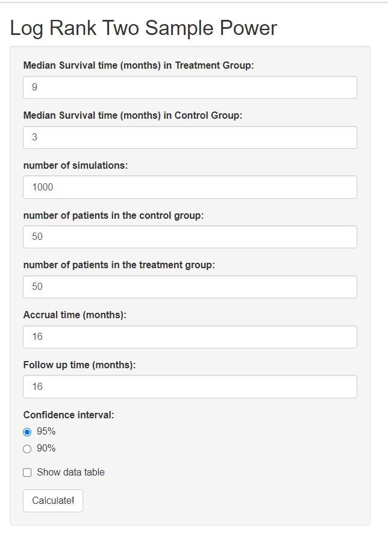

 
Log Rank Power 
=============


Log rank power calculator is a shiny app for calculating power based on simulation of a log rank test for two groups. It also generates a report so clinicians could easily incorporate it into a clinical trial protocol.


- Inputs
  - Median survival time (months) for treatment group
  - Median survival time (months) for the control group
  - The number of simulations 
  - Size of treatment group
  - Size of control group
  - Accrual time (months)
  - Follow up time (months)
  - Confidence level (95% or 90%)
  
 

## Installation

Simply run the following from an R console:

```r
if (!require("devtools"))
  install.packages("devtools")
devtools::install_github("dungtsa/Clinical-Significance-and-Statistical-Significance",force = TRUE)
```

## Getting Started

```r
require("LongRankPower")
Log_Rank_Power()
```

Snapshot of shiny app: initial 

